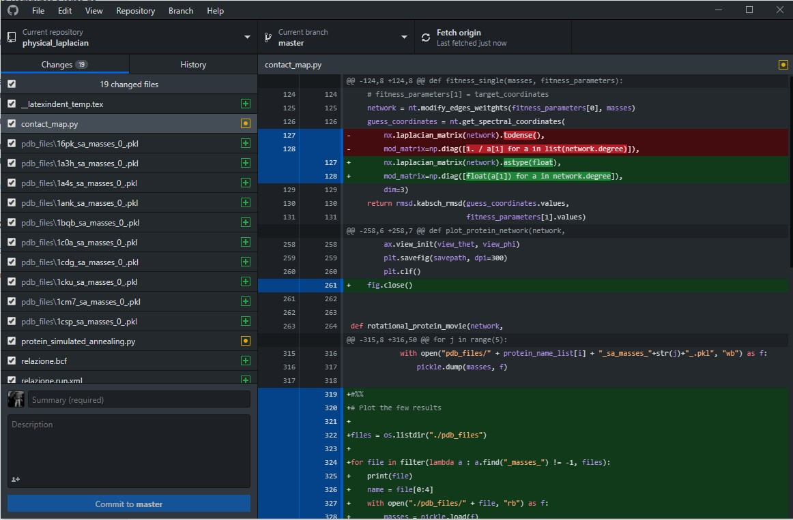

# Git è una cosa bella!

## main\_ritoccato\_finale\_finalissimo\_davvero\_v3\_lastversion.cpp

Lavorare su di un progetto informatico in divenire significa avere una cartella piena zeppa di file di codice e dati e sottocartelle che subiscono costantemente variazioni quasi sempre repentine e disordinate.

Inevitabilmente, arriva il momento in cui si vuole recuperare una versione vecchia del codice scritto.

Quando questo succede, ci si può trovare in 3 situazioni diverse:

1. Non sono state fatte copie delle precedenti versioni del codice. In tal caso si scoppia in lacrime amare.
2. Sono state fatte 26 copie delle precedenti versioni del codice in 26 file di diverso nome in 26 diverse posizioni. In tal caso si perde l'anima nel tentativo di recuperare la versione giusta.
3. L'intera directory di lavoro è stata tenuta sotto traccia da un valido programma di Version Control quale Git ed è stato eseguito un adeguato numero di commit e branch che tengono traccia di tutti gli sviluppi del codice.

Git è uno strumento che permette di tenere traccia, riga per riga, di tutti i cambiamenti fatti ad un qualsiasi file di plain text \(e.g. un codice .cpp, un codice .tex, con codice .py, un qualsiasi file di testo non in formato binario\). Permette di raggruppare tali cambiamenti in dei "commit" che descrivono che cosa rappresentano tali cambiamenti con una descrizione annessa e, soprattutto, permette di lavorare in gruppo su di una stessa cartella di lavoro offrendo una struttura ad albero per gestire diversi branching di sviluppo da unificare alla fine in un unico branch master.

Inoltre, permette di caricare tali progetti su piattaforme di condivisione molto social quali Github e Gitlab, dalle quali è possibile reperire ogni sorta di codice e progetto estremamente interessante.

##  Non ho capito un cavolo di quello che hai scritto

È normale, anche io non ci capivo nulla all'inizio. Questo è dovuto al fatto che Git è nato come programma per sviluppatori software professionisti e, inevitabilmente, finisce per avere tutto un suo gergo decisamente poco chiaro a chi comincia da zero. Soprattutto perché gran parte delle sue features servono solo a team di migliaia di programmatori.

E questo è problematico, dal momento che gli strumenti che offre sono di estrema comodità per chiunque, soprattutto per un fisico che ha da collaborare a progetti di ricerca di gruppo con forte componente software.

Git tuttavia è più facile a farsi che a dirsi. Ragion per cui val la pena di cominciare da questo splendido [tutorial breve su Youtube](https://www.youtube.com/watch?v=Y9XZQO1n_7c), per poi andare a cazzeggiare un po' su questo [sito di addestramento](https://learngitbranching.js.org/) alla linea di comando Git.

### Non voglio memorizzare altri comandi da terminale, la mia vita è già abbastanza orribile così

Ed è più che giusto! Per questo ogni editor moderno come Sublime Text o Visual Studio Code supportano una interfaccia grafica di Git di default che permette di visualizzare immediatamente quali modifiche sono state fatte e quali tasti bisogna premere per fare un commit ed un push! Quindi anche stavolta ogni strumento viene in aiuto diretto!

Se questo non basta, [Github Desktop](https://desktop.github.com/) è uno dei migliori programmi disponibili per tenere traccia delle proprie modifiche e gestire ogni cosa con pochi click di mouse.

### Tutto questo è terribile. Ne vale davvero la pena?

Dipende a seconda del progetto e delle sue dimensioni, ma oserei dire quasi sempre sì. Per il semplice fatto che, se usato bene, Git offre la possibilità di avere uno storico completo dello sviluppo di un progetto dall'inizio alla fine. Il valore di questa cosa in termini di tempo risparmiato è incommensurabile e permette di avere sempre sottomano una macchina del tempo in caso di disastro inenarrabile a livello di modifiche rompi codice.

### 

